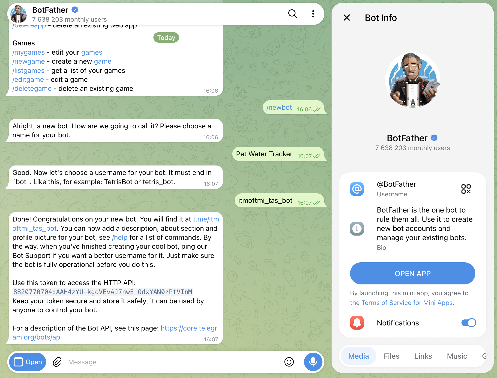
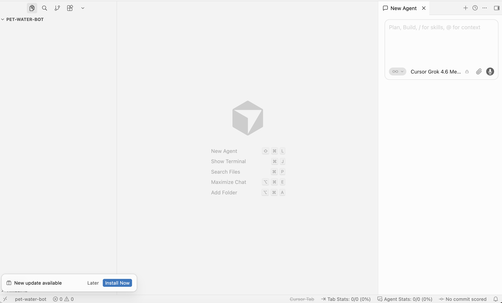
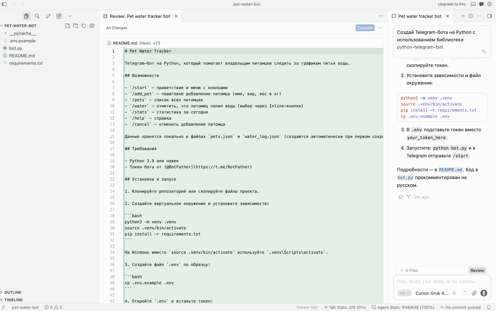
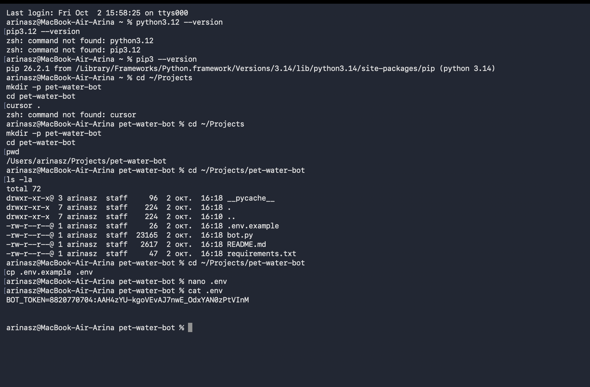
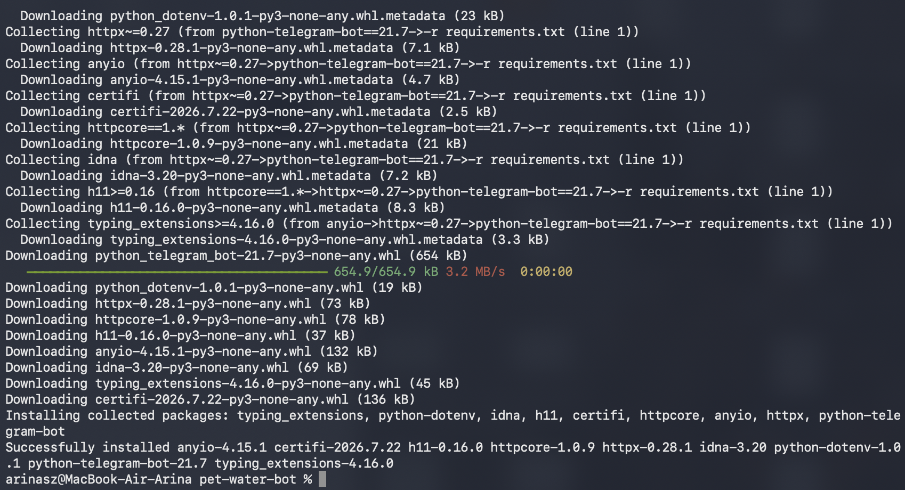
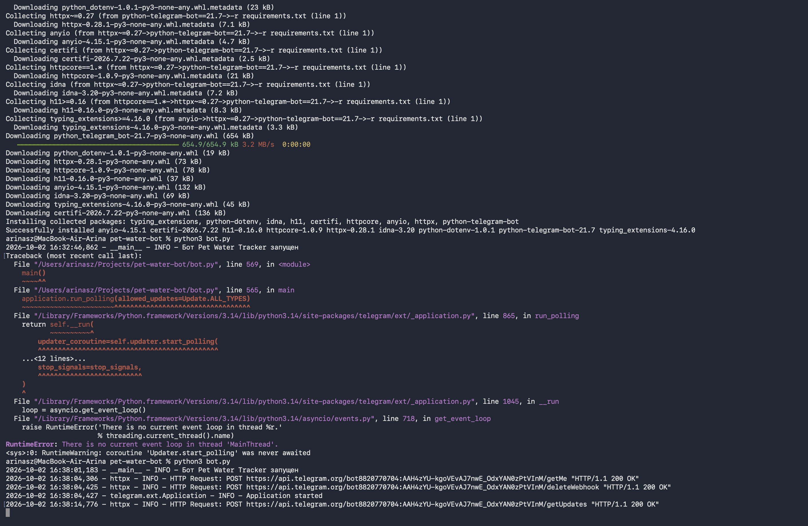
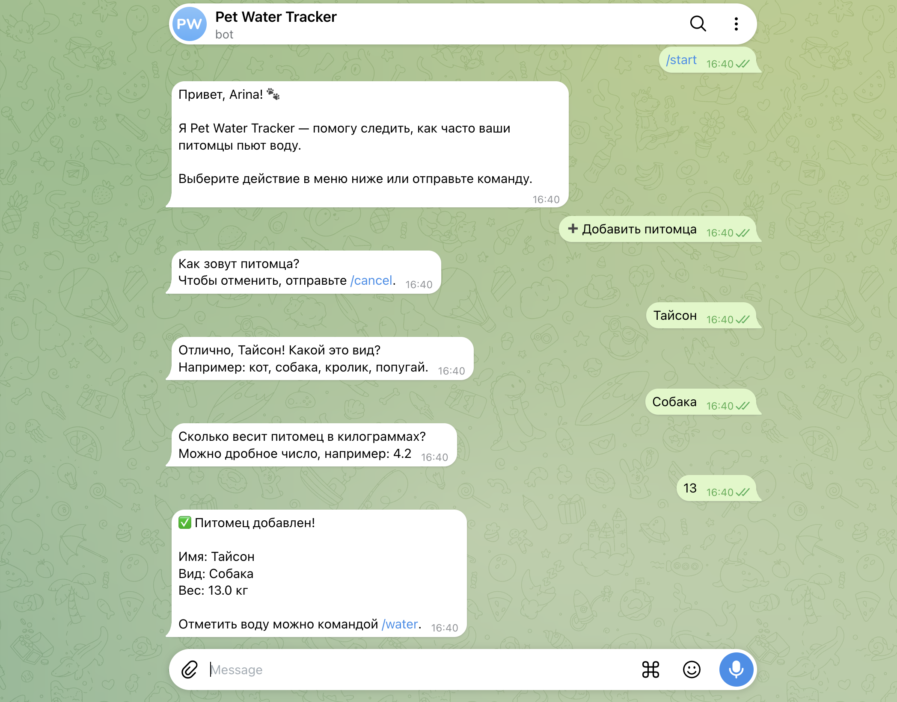
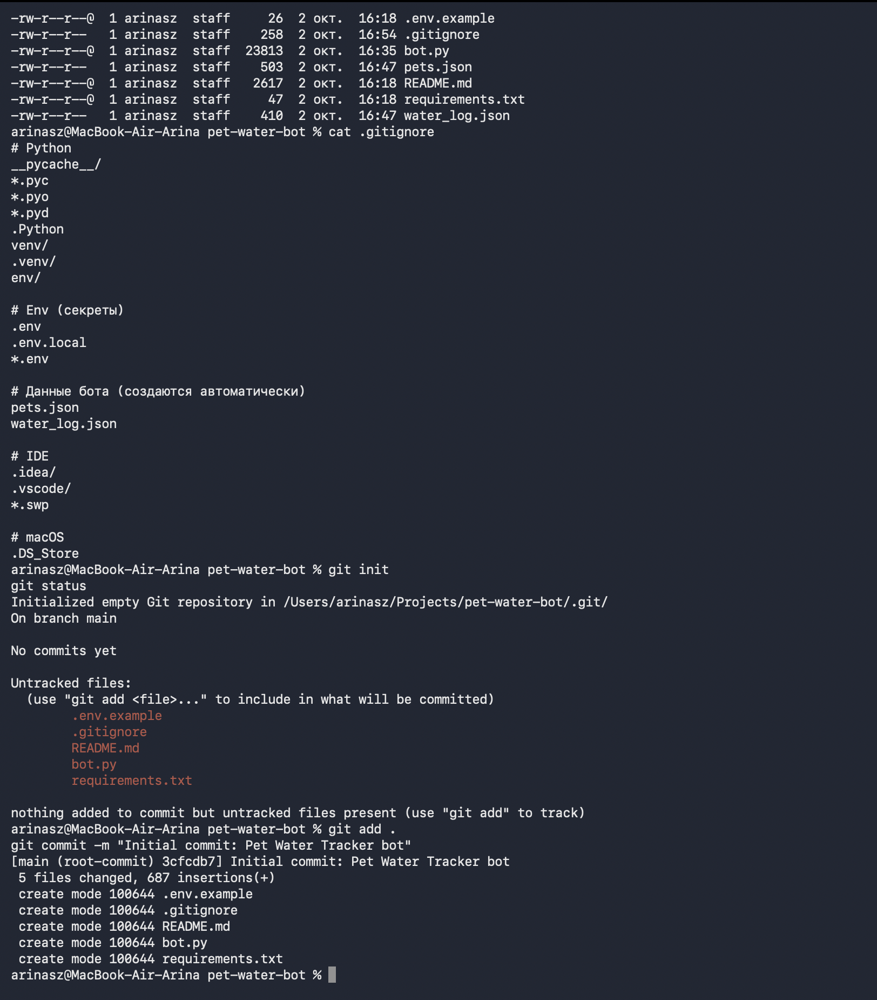

University: [ITMO University](https://itmo.ru/ru/)
Faculty: [FICT](https://fict.itmo.ru)
Course: [Vibe Coding: AI-боты для бизнеса](https://github.com/itmo-ict-faculty/vibe-coding-for-business)
Year: 2025/2026
Group: u4225
Author: Тузовская Арина Сергеевна
Lab: Lab1
Date of create: 02.10.2026
Date of finished: 02.10.2026

## Цель работы

Научиться создавать работающего Telegram-бота для решения реальных бизнес-задач, используя AI-инструменты (Cursor) вместо ручного написания кода.

## Описание задачи

**Название бота:** Pet Water Tracker
**Username:** `@itmoftmi_tas_bot`

**Проблема, которую решает бот:** владельцы домашних питомцев часто забывают следить за тем, как часто их питомцы пьют воду. Особенно это важно для животных с заболеваниями почек, диабетом или в жаркую погоду.

**Почему выбрана эта задача:** у меня есть собака Тайсон (13 кг), и мне не хватает простого инструмента, чтобы отслеживать её питьевой режим. Существующие приложения перегружены функциями, а лёгкого бота с командой «отметить, что попил» — нет.

**Функционал бота:**

- `/start` — приветствие и меню с кнопками
- `/add_pet` — пошагово добавить питомца (имя, вид, вес)
- `/pets` — список всех питомцев
- `/water` — отметить, что питомец попил воды (с выбором питомца через кнопки)
- `/stats` — статистика за сегодня
- `/help` — справка

## Промпт для LLM

Работа велась в **Cursor** — редакторе кода со встроенным AI-ассистентом.

### Исходный промпт

~~~text
Создай Telegram-бота на Python с использованием библиотеки python-telegram-bot.

Функционал бота "Pet Water Tracker" — помощник для владельцев питомцев,
который помогает следить за графиком питья воды.

Команды:
- /start — приветствие и меню с кнопками
- /add_pet — пошагово добавить питомца (имя, вид, вес в кг)
- /pets — показать список всех питомцев
- /water — отметить, что питомец попил воды (с выбором через кнопки)
- /stats — статистика за сегодня
- /help — справка

Требования:
- Бот простой и понятный
- Код хорошо прокомментирован на русском
- Данные хранятся в JSON-файле (pets.json и water_log.json)
- Использовать ConversationHandler для диалога добавления питомца
- Добавить обработку ошибок (try/except)
- Токен бота читается из переменной окружения (.env)
- Использовать библиотеку python-dotenv
- Все тексты бота — на русском языке
- Кнопки InlineKeyboard для выбора питомца

Создай 4 файла:
1. bot.py — основной код бота
2. requirements.txt — зависимости
3. README.md — инструкция по запуску
4. .env.example — пример конфигурации
~~~

### Итерации и улучшения

**Итерация 1 — исправление ошибки event loop.**

При первом запуске бот падал с ошибкой:
`RuntimeError: There is no current event loop in thread 'MainThread'`

Причина: Python 3.14 больше не создаёт event loop автоматически, а библиотека `python-telegram-bot 21.7` его ожидает.

Промпт для исправления:

~~~text
При запуске bot.py возникает ошибка:
RuntimeError: There is no current event loop in thread 'MainThread'.

Причина: Python 3.14 несовместим с python-telegram-bot 21.7.
Исправь код так, чтобы он работал на Python 3.14:
явно создавай event loop через asyncio.set_event_loop().
~~~

**Итерация 2 — устранение дублей сообщений.**

После смены токена бот начал отвечать на каждое сообщение дважды.

Промпт для диагностики:

~~~text
У меня Telegram-бот. Проблема: сообщения обрабатываются дважды —
бот отвечает дважды на каждое сообщение.
Проверь код на: дублирующиеся хендлеры, два вызова run_polling,
конфликт webhook + polling. Исправь.
~~~

AI определил, что причина **не в коде**, а во внешних факторах: на токене оставался webhook, и/или параллельно работал второй экземпляр бота. AI добавил:

- вызов `delete_webhook(drop_pending_updates=True)` перед polling;
- ограничение `allowed_updates` до `message` и `callback_query`;
- файловую блокировку `.bot.lock` — защиту от запуска второго экземпляра.

### Финальный промпт

Финальная версия — исходный промпт плюс два уточнения из итераций (обработка event loop для Python 3.14 и защита от дублей).

## Стек технологий

- **Python 3.14** — язык разработки;
- **python-telegram-bot 21.7** — основная библиотека для работы с Telegram Bot API;
- **python-dotenv 1.0.1** — для чтения токена из `.env`;
- **JSON** — для хранения данных (`pets.json`, `water_log.json`);
- **Cursor** — AI-редактор для генерации и правки кода;
- **Git + GitHub** — для хранения кода.

**Почему именно эти библиотеки:**
- `python-telegram-bot` — самая популярная библиотека для Telegram-ботов на Python, поддерживает ConversationHandler, InlineKeyboard, асинхронность;
- `python-dotenv` — стандартный способ хранить секреты в `.env`, который не попадает в Git;
- JSON — простой формат для MVP, не требует СУБД.

## Скриншоты работы бота

### Создание бота в BotFather

### Сгенерированный код в Cursor

### Проверка `.gitignore` и `git status`

Файлы `.env`, `__pycache__`, `pets.json`, `water_log.json` не попадают в Git.

### Установка зависимостей

### Запуск бота

### Работа бота в Telegram

**Добавление питомца через `/add_pet`:**

### Публикация кода в GitHub

**Ссылка на репозиторий:** [github.com/mangochiaa/pet-water-bot](https://github.com/mangochiaa/pet-water-bot)

## Видео-демо

**Ссылка:** https://drive.google.com/file/d/1S8njEwRlSno64rrVcYLxorznTYZkxLoo/view

Показаны: открытие бота, `/start`, добавление питомца через `/add_pet`, отметка воды через `/water`, статистика `/stats`.

## Трудности и решения

### 1. Ошибка `RuntimeError: There is no current event loop`

**Проблема:** бот падал из-за несовместимости Python 3.14 с `python-telegram-bot 21.7`.
**Решение:** AI добавил функцию `_ensure_event_loop()`, которая явно создаёт event loop перед запуском polling. Без лишних зависимостей.

### 2. Дубли сообщений от бота

**Проблема:** после смены токена бот начал отвечать на каждое сообщение дважды.
**Решение:** AI проанализировал код — проблема не в двойных хендлерах, а во внешних факторах. Добавил `delete_webhook(drop_pending_updates=True)`, ограничил `allowed_updates` и добавил файловую блокировку `.bot.lock`. Дубли исчезли.

### 3. Утечка токена

**Проблема:** токен бота мог попасть в публичный репозиторий.
**Решение:** настроен `.gitignore` (Python + `.env` + JSON-данные), создан `.env.example` с плейсхолдером. Токен отозван через BotFather после обнаружения утечки.

## Выводы

**Что получилось хорошо:**
- Бот полностью работает и выполняет заявленный функционал;
- Код сгенерирован AI и прокомментирован на русском;
- Код опубликован в GitHub с защитой секретов;
- Решены две нестандартные проблемы (Python 3.14 + event loop, дубли) через итеративные промпты.

**Что можно улучшить:**
- Добавить напоминания по расписанию (например, 9:00, 15:00, 21:00);
- Экспорт статистики в виде графика за неделю;
- Поддержка нескольких пользователей с разделением данных;
- Использовать SQLite вместо JSON для масштабирования.

**Чему научилась:**
- Формулировать точные промпты: чем конкретнее требования, тем лучше результат;
- Работать в Cursor: применять изменения и итеративно улучшать код;
- Настраивать `.gitignore`, чтобы не утекали секреты;
- Отзывать токены в BotFather при подозрении на утечку;
- Диагностировать проблемы: отличать ошибки кода от внешних факторов (webhook, второй процесс).
