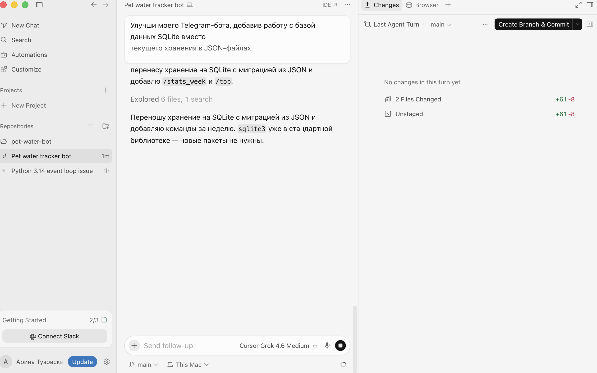
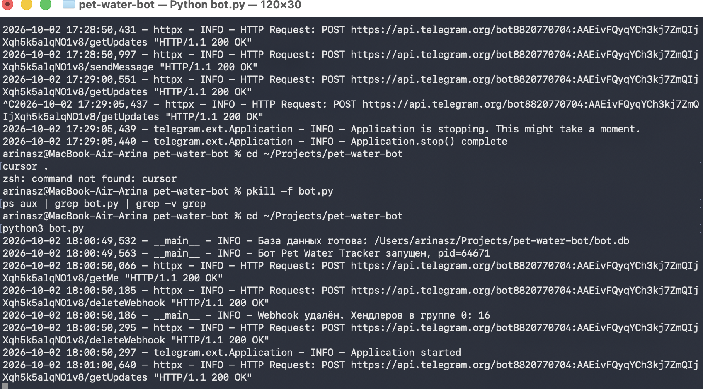
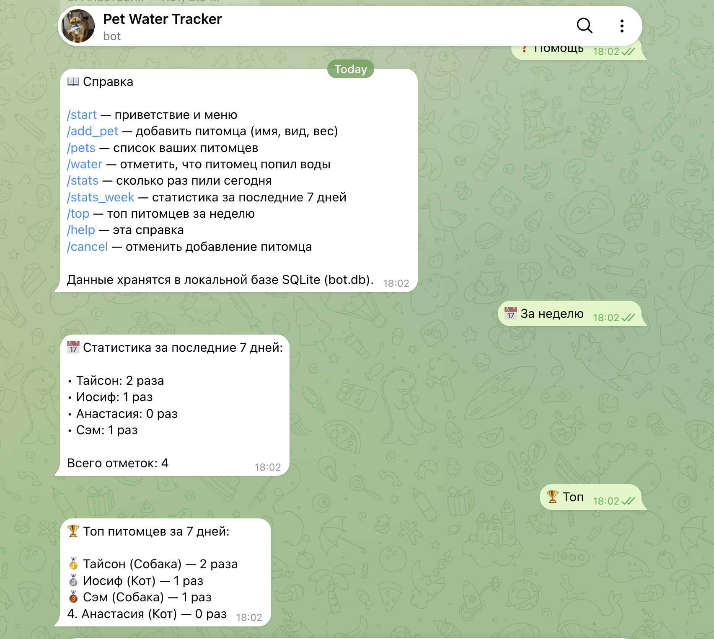
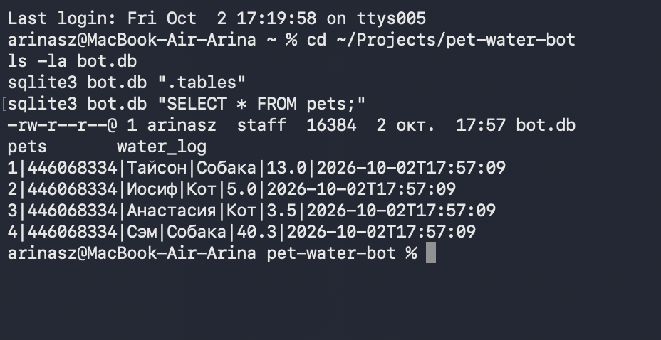
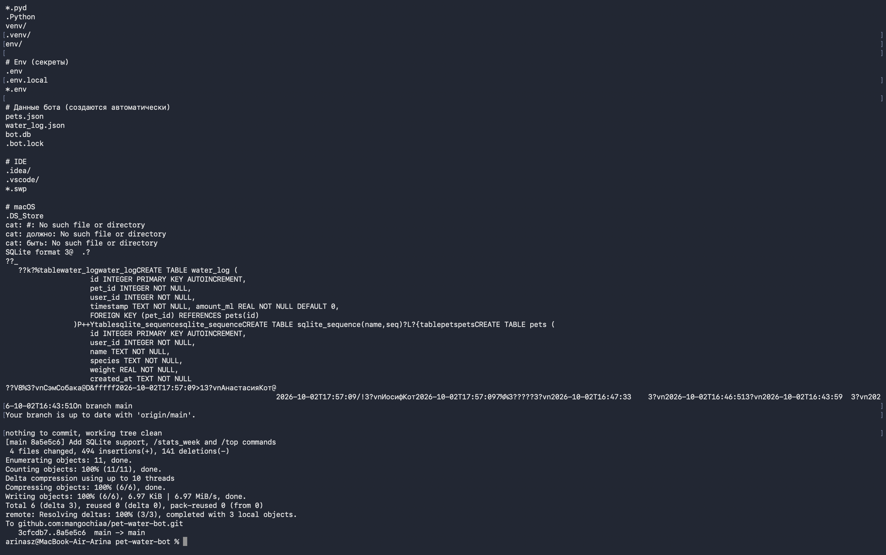

University: [ITMO University](https://itmo.ru/ru/)
Faculty: [FICT](https://fict.itmo.ru)
Course: [Vibe Coding: AI-боты для бизнеса](https://github.com/itmo-ict-faculty/vibe-coding-for-business)
Year: 2026
Group: u4225
Author: Тузовская Арина Сергеевна
Lab: Lab2
Date of create: 02.10.2026
Date of finished: 02.10.2026

## Цель работы

Научиться подключать Telegram-бота к внешним источникам данных через LLM-генерацию кода. Освоить работу с базой данных SQLite, миграцию данных из файлов и добавление новых команд.

## Описание задачи

**Бот:** Pet Water Tracker (`@itmoftmi_tas_bot`)
**Тип интеграции:** Простая база данных (SQLite)

**Что было:** в Lab1 данные бота хранились в JSON-файлах (`pets.json`, `water_log.json`). Это неудобно: нет поиска, нет аналитики, плохо масштабируется.

**Что нужно:** перенести хранение на SQLite, добавить новые команды аналитики:
- `/stats_week` — статистика за последние 7 дней
- `/top` — топ питомцев за неделю

**Почему SQLite:** встроена в Python (`import sqlite3`), не требует установки, работает с одного файла `bot.db`, поддерживает SQL-запросы для аналитики.

## Промпт для LLM

### Исходный промпт

~~~text
Улучши моего Telegram-бота, добавив работу с базой данных SQLite вместо
текущего хранения в JSON-файлах.

Текущий функционал бота:
- /start — приветствие и меню
- /add_pet — пошаговое добавление питомца (имя, вид, вес)
- /pets — список питомцев
- /water — отметить, что питомец попил
- /stats — статистика за сегодня
- Данные хранятся в pets.json и water_log.json

Новый функционал (SQLite):
- Перенести хранение данных из JSON в SQLite (файл bot.db)
- Создать две таблицы:
  * pets (id, user_id, name, species, weight, created_at)
  * water_log (id, pet_id, user_id, timestamp)
- Мигрировать существующие данные из pets.json и water_log.json
  в SQLite при первом запуске (если файлы существуют)
- Переписать все функции работы с данными на SQL-запросы
- Добавить команду /stats_week — статистика за последние 7 дней
- Добавить команду /top — топ питомцев по количеству записей за неделю

Требования:
- Код должен быть простым и понятным
- Добавить обработку ошибок (try/except) для работы с БД
- Хорошие комментарии на русском
- Сохранить весь существующий функционал
- Файлы JSON можно удалить после миграции (код миграции оставить)

Создай:
1. Обновленный bot.py
2. Обновленный requirements.txt (если нужны новые библиотеки)
3. Обновленный README.md с описанием новых команд
~~~

### Результат работы AI

AI выполнил задачу полностью:

- Перешёл на SQLite: файл `bot.db`, две таблицы — `pets` и `water_log`;
- Написал миграцию из JSON в SQL (старые данные переносятся при первом запуске, после чего JSON-файлы удаляются);
- Переписал все операции работы с данными на SQL-запросы с `try/except`;
- Добавил команды `/stats_week` и `/top`;
- Обновил `.gitignore` (добавил `bot.db` и `.bot.lock`);
- Обновил `README.md` с описанием таблиц и новых команд.

**Изменения:** `4 files changed, 494 insertions(+), 141 deletions(-)`.

### Итерации

Дополнительная итерация по улучшению бота (запись объёма воды в мл, выбор вида питомца кнопками) была **отложена до Lab3**, потому что лимит бесплатных AI-запросов в Cursor закончился. Все основные требования Lab2 при этом выполнены.

### Финальный промпт

Совпадает с исходным — AI справился с первого раза.

## Стек технологий

- **Python 3.14** — язык разработки;
- **python-telegram-bot 21.7** — библиотека для работы с Telegram Bot API;
- **python-dotenv 1.0.1** — чтение токена из `.env`;
- **sqlite3** (стандартная библиотека Python) — база данных;
- **Cursor** — AI-редактор для генерации кода;
- **Git + GitHub** — хранение кода.

**Почему именно эти технологии:**

- **SQLite** — не требует установки, поддерживает SQL, идеально для MVP. Простое переключение с JSON.
- **sqlite3** встроен в Python — не нужно добавлять новые зависимости в `requirements.txt`.
- **python-telegram-bot** — уже используется в Lab1, всё совместимо.

## Структура базы данных

**Таблица `pets`:**
| Поле | Тип | Описание |
|---|---|---|
| id | INTEGER PRIMARY KEY AUTOINCREMENT | Уникальный ID питомца |
| user_id | INTEGER NOT NULL | ID пользователя Telegram |
| name | TEXT NOT NULL | Имя питомца |
| species | TEXT NOT NULL | Вид (Кот, Собака, и т.д.) |
| weight | REAL NOT NULL | Вес в кг |
| created_at | TEXT NOT NULL | Дата добавления |

**Таблица `water_log`:**
| Поле | Тип | Описание |
| --- | --- | --- |
| id | INTEGER PRIMARY KEY AUTOINCREMENT | Уникальный ID записи |
| pet_id | INTEGER NOT NULL | Ссылка на питомца |
| user_id | INTEGER NOT NULL | ID пользователя |
| timestamp | TEXT NOT NULL | Дата и время |
| amount_ml | REAL NOT NULL DEFAULT 0 | Объём воды в мл (задел на будущее) |

## Скриншоты работы

### Запуск бота с SQLite

В логах видно: база данных создана, миграция прошла, хендлеры зарегистрированы, бот запущен.

### Новые команды в Telegram

Справка `/help` содержит новые команды `/stats_week` и `/top`. Обе команды работают — показывают статистику за 7 дней.

### Проверка базы данных через sqlite3

Таблицы `pets` и `water_log` созданы. В `pets` мигрированы 4 питомца из JSON (Тайсон, Иосиф, Анастасия, Сэм) — миграция данных успешна.

### Публикация обновления в GitHub

~~~bash
git add .
git commit -m "Add SQLite support, /stats_week and /top commands"
git push origin main
~~~

Коммит `8a5e5c6`: 4 файла изменено, 494 добавления, 141 удаление.

**Ссылка на репозиторий:** [github.com/mangochiaa/pet-water-bot](https://github.com/mangochiaa/pet-water-bot)

## Демонстрация работы

Видео-демо в этой лабораторной не записывалось. Работа бота с данными подтверждается скриншотами команд в Telegram и проверкой базы данных через `sqlite3`.

## Трудности и решения

### 1. Миграция данных без потерь

**Проблема:** у бота уже были данные в JSON-файлах (`pets.json`, `water_log.json`). Просто удалить их было нельзя — пользователь потерял бы всех питомцев.
**Решение:** AI написал функцию миграции, которая при первом запуске читает JSON, переносит данные в SQLite (с преобразованием строковых id в целые), и только после этого удаляет старые файлы. Проверка показала, что все 4 питомца и 4 отметки воды перенесены без потерь.

### 2. Защита `bot.db` от коммита

**Проблема:** файл `bot.db` содержит данные пользователей и не должен попадать в публичный GitHub-репозиторий.
**Решение:** в `.gitignore` добавлены строки `bot.db` и `*.db`. Проверка через `git status` подтвердила, что база не попадает в коммит.

### 3. Лимит бесплатных запросов в Cursor

**Проблема:** при попытке добавить вторую итерацию улучшений (объём воды в мл, кнопки выбора вида питомца) закончился бесплатный лимит AI-запросов.
**Решение:** улучшения перенесены в Lab3 (там как раз тема — деплой и доработка по фидбеку). Основные требования Lab2 при этом выполнены полностью.

## Выводы

**Что получилось хорошо:**

- Бот переведён с JSON на SQLite — данные структурированы, доступны для SQL-аналитики;
- Миграция прошла без потерь: 4 питомца и 4 записи о воде перенесены автоматически;
- Новые команды `/stats_week` и `/top` работают и показывают агрегированные данные за период;
- Секреты защищены: `.env`, `bot.db`, `.bot.lock` в `.gitignore`;
- Код создан LLM, прокомментирован на русском, с обработкой ошибок.

**Что можно улучшить (в Lab3):**

- Записывать объём воды в мл при каждом `/water` (поле `amount_ml` в БД уже есть);
- Выбор вида питомца через InlineKeyboard-кнопки вместо текстового ввода;
- Экспорт статистики в виде графика (matplotlib или вывод SVG);
- Добавление напоминаний по расписанию (например, через `job_queue` в `python-telegram-bot`).

**Чему научилась:**

- Формулировать промпты для LLM, в которых AI нужно **обновить существующий код**, а не написать с нуля — нужно описать текущий функционал и требования к нему;
- Работать с SQLite: `CREATE TABLE`, `ALTER TABLE`, `SELECT`, `INSERT`, миграция данных;
- Понимать, что в публичный репозиторий не должны попадать `.env`, `.db`-файлы и другие секреты;
- Использовать SQL для простой аналитики (GROUP BY, SUM, ORDER BY).
