University: [ITMO University](https://itmo.ru/ru/)
Faculty: [FICT](https://fict.itmo.ru)
Course: [Vibe Coding: AI-боты для бизнеса](https://github.com/itmo-ict-faculty/vibe-coding-for-business)
Year: 2025/2026
Group: u4225
Author: Тузовская Арина Сергеевна
Lab: Lab3
Date of create: 02.10.2026
Date of finished: 03.10.2026

## Цель работы

Научиться деплоить бота и собирать обратную связь от реальных пользователей для улучшения продукта.

## 1. Описание деплоя

**Способ деплоя:** облачный хостинг **Railway**.

**Почему выбран именно этот способ:**

- Railway деплоит напрямую из GitHub-репозитория. При пуше в `main` проект пересобирается автоматически.
- Бот работает **24/7 без моего Mac** — в отличие от локального запуска или ngrok.
- Есть бесплатный тариф, которого достаточно для небольшого бота.
- Не нужно администрировать сервер — Railway сам следит за процессом.
- Работает через `Procfile` (`worker: python bot.py`) — Railway понимает, что это воркер, а не веб-сервис, и не требует открытый HTTP-порт.

**URL бота:** `t.me/itmoftmi_tas_bot`

**Инфраструктура на Railway:**

- **Service:** `pet-water-bot` (привязан к GitHub-репозиторию `mangochiaa/pet-water-bot`, ветка `main`)
- **Volume:** `pet-water-bot-volume`, смонтирован в `/data` — база данных сохраняется между деплоями
- **Переменные окружения:**
  - `BOT_TOKEN` — токен от BotFather
  - `DB_PATH` — `/data/bot.db` (путь к базе в Volume)

## 2. Процесс деплоя

### 2.1. Подготовка проекта

Перед деплоем нужно было адаптировать бота под работу в облаке. Основная проблема: путь к базе был захардкожен — файл `bot.db` лежал рядом с `bot.py`. При деплое в контейнер этот файл не попадал (он в `.gitignore`), и данные терялись бы при каждом перезапуске.

**Что было сделано:**

1. **DB_PATH через переменную окружения.** Путь к базе теперь читается из переменной `DB_PATH`, а в Railway Volume она указывает на `/data/bot.db`. Все функции работы с БД открывают соединение через единую функцию `get_db()`.

2. **Procfile.** Добавлен файл `Procfile` со строкой `worker: python bot.py`. Это говорит Railway, что приложение — воркер, а не веб-сервис.

3. **README.md.** Добавлен раздел «Деплой на Railway» с описанием переменных окружения и настройки Volume.

**О том, как пришлось переключиться на Claude Code:**

Изначально я работала в **Cursor** — это AI-редактор с графическим интерфейсом, в котором я делала Lab1 и Lab2. Но когда я начала добавлять новые фичи (объём воды, кнопки типа питомца, `/norm`, `/delete_pet`), у меня **закончился лимит AI-запросов** на бесплатном тарифе Cursor. Задача была большой: миграция базы данных + переписывание части кода + 4 новые команды.

Так как у меня уже была подписка **Claude Pro**, я решила переключиться на **Claude Code** — это официальный CLI-инструмент Anthropic, работающий в терминале. Установка заняла пару минут (через `curl`), единственный минус — вход только через браузер (OAuth), но это тоже быстро.

**Что дало переключение на Claude Code:**

- **Видит весь проект целиком** — не нужно пересказывать контекст в каждом запросе. Claude сам читает `bot.py`, `README.md`, `.gitignore`, смотрит структуру БД.
- **Работает в терминале напрямую с файлами** — сам запускает `sqlite3` для проверки базы, `ls`, `git`, `python3`. Мне не нужно копировать команды вручную.
- **Проверяет изменения на копии базы** — перед коммитом Claude прогнал миграцию на резервной копии `bot.db.backup-2026-10-03`, чтобы убедиться, что данные не потеряются. Только после проверки — коммит.
- **Делает коммиты в отдельной ветке** — `feature/water-ml-norm`. Сначала проверка, потом мердж в `main` через `fast-forward`. Это правильный Git-флоу.
- **Сам придумывает проверки** — например, что нельзя удалить чужого питомца (фильтр по `user_id`), что старые Inline-кнопки не сработают повторно («кнопка устарела»).
- **Отключает опасные логи** — Claude заметил, что библиотека `httpx` пишет URL запросов вместе с токеном бота. Он отключил INFO-логи httpx, чтобы токен не попадал в логи.

Итог: **Claude Code оказался удобнее для крупных задач**, а Cursor — для мелких правок. Оба инструмента дополняют друг друга.

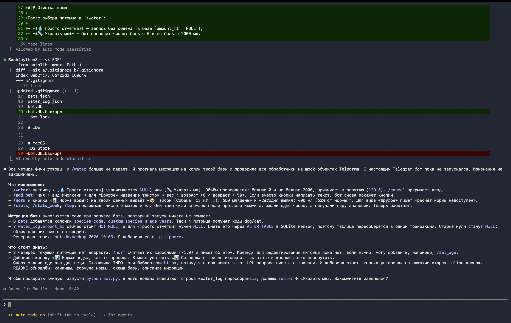

После запуска бота база автоматически мигрировала — добавились колонки `species_code`, `custom_species`, `age_years`, а таблица `water_log` была пересобрана для поддержки `amount_ml` с NULL:

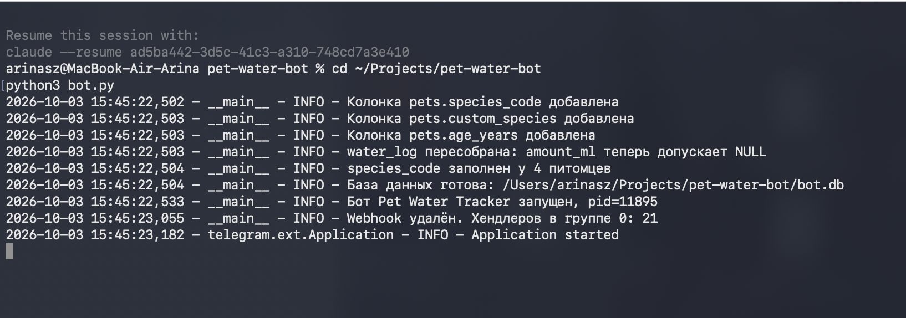

Изменения были закоммичены и запушены в ветку `main` через Claude Code:

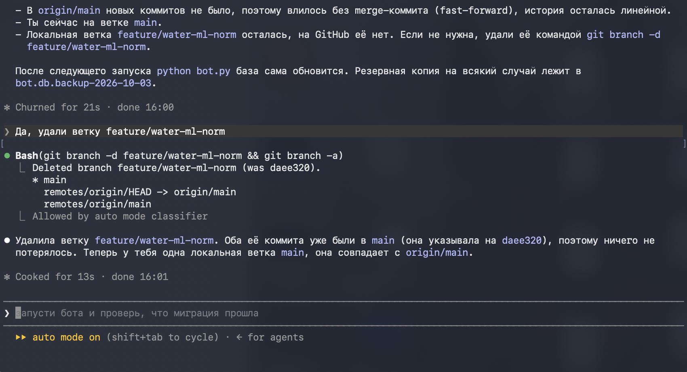

После успешного мерджа локальная ветка `feature/water-ml-norm` была удалена — она больше не нужна:

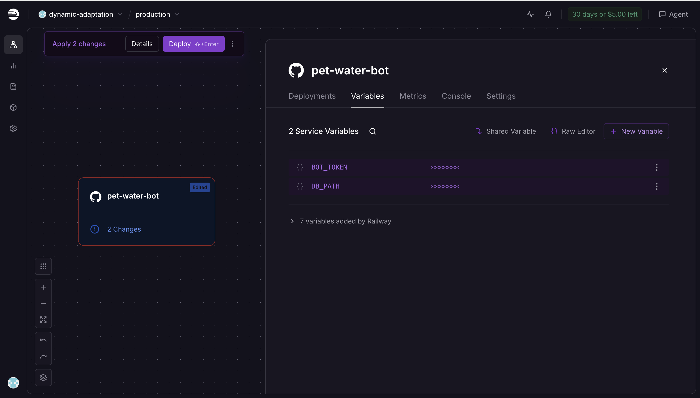

### 2.2. Настройка Railway

1. **Регистрация.** Зашла на railway.app через GitHub-аккаунт.
2. **Создание проекта.** New Project → Deploy from GitHub repo → выбрала `mangochiaa/pet-water-bot`.
3. **Volume.** Создан Volume `pet-water-bot-volume` с mount path `/data`.
4. **Переменные.** В Variables добавлены `BOT_TOKEN` и `DB_PATH=/data/bot.db`.
5. **Деплой.** Нажата кнопка Deploy — Railway собрал образ и запустил бота.

**Volume** подключён к сервису и сохраняет базу между деплоями:

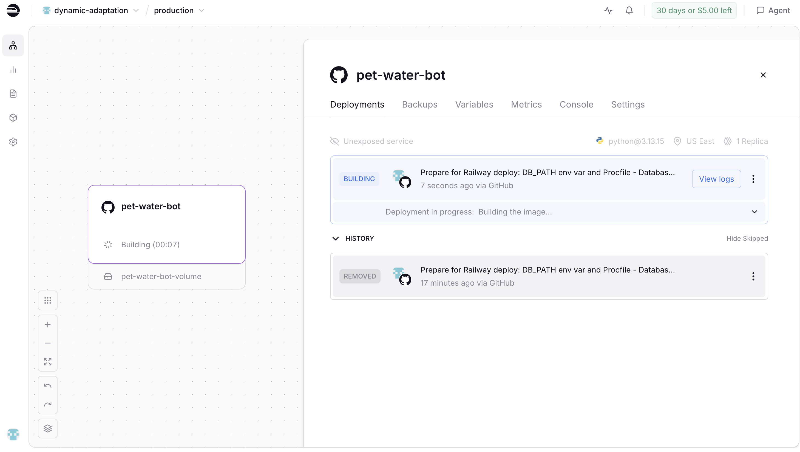

**Переменные окружения** заданы в панели Railway Variables:

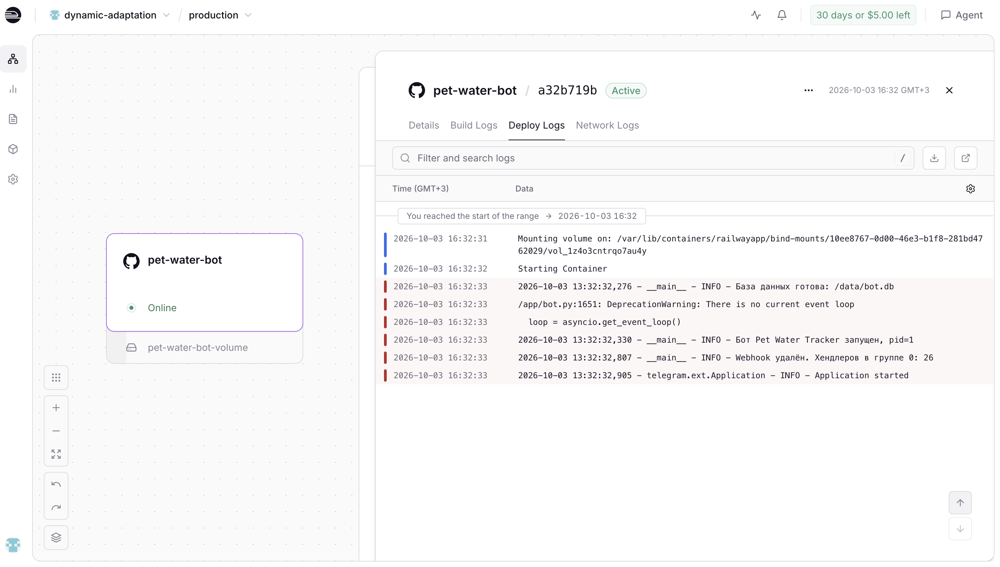

**Логи успешного деплоя** — база данных готова, бот запущен, webhook удалён, все хендлеры зарегистрированы:

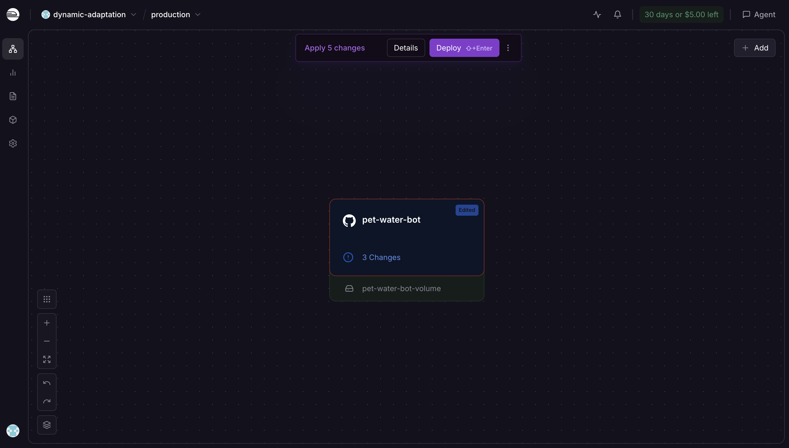

### 2.3. Проблемы и их решение

**Проблема 1: первый деплой упал с ошибкой «Не задан BOT_TOKEN».**

Причина: переменные окружения не были заданы до первого деплоя. Railway запустил контейнер, но бот не нашёл токен и завершился.

Решение: добавила `BOT_TOKEN` и `DB_PATH` в Variables → Redeploy. Второй деплой прошёл успешно.

**Проблема 2: кнопка «Auto deploy» показывала «unavailable».**

Причина: Railway потерял доступ к списку веток GitHub-репозитория.

Решение: переподключила ветку `main` через Settings → Source. Деплой можно триггерить вручную через кнопку Deploy, если автодеплой не срабатывает.

**Проблема 3: незавершённые изменения от Cursor.**

Когда у меня закончился лимит в Cursor, часть кода уже была изменена, но не доделана: функция `log_water` теперь требовала параметр `amount_ml`, но вызывалась без него. Из-за этого команда `/water` выдавала ошибку «Произошла ошибка при сохранении отметки».

Решение: Claude Code прочитал код, нашёл причину (`TypeError: log_water() missing 1 required positional argument: 'amount_ml'`) и **доделал** изменения — добавил UI для выбора объёма воды. Также он проверил, что после исправления `/water` работает.

## 3. Сбор фидбека

**Количество пользователей:** 3 человека.

**Метод сбора:** личные сообщения в мессенджере + устный опрос. Пользователям была дана ссылка на бота (`t.me/itmoftmi_tas_bot`) и список команд для тестирования.

**Что спрашивала:**

- Что понравилось?
- Что неудобно или непонятно?
- Что бы добавил(а)?
- Хотел(а) бы использовать такого бота для своего питомца?

**Отзывы:**

**Пользователь 1:**
> «Неудобно вводить тип питомца текстом — постоянно забываю, как правильно писать «собака» или «Собака». Лучше бы были кнопки.»

**Пользователь 2:**
> «Добавила питомца с ошибкой в имени, не смогла удалить. Пришлось создавать второго. Нужна команда удаления.»

**Пользователь 3:**
> «Интересный бот. Хотелось бы видеть статистику не только за день, но и за неделю.»

**Дополнительно (мой собственный фидбек):**

Я сама пользовалась ботом и поняла, что не хватает:

- **Указания объёма воды в миллилитрах** — это критично для животных с болезнями почек (например, у моей собаки Тайсона были проблемы с почками).
- **Расчёта рекомендованной нормы воды** — ветеринары рекомендуют ~50 мл на кг веса для собак и кошек. Хотелось бы, чтобы бот сам считал норму с учётом возраста.

## 4. Анализ фидбека

**Главные проблемы, выявленные пользователями:**

1. **Ввод типа питомца текстом неудобен** — 1 жалоба.
2. **Нет возможности удалить питомца** — 1 жалоба (блокирующая проблема).
3. **Не хватает статистики за неделю** — 1 пожелание.

**Приоритеты улучшений:**

| Приоритет | Улучшение | Источник |
|---|---|---|
| 🔴 Высокий | Кнопки выбора типа питомца | Фидбек пользователя 1 |
| 🔴 Высокий | Команда /delete_pet для удаления | Фидбек пользователя 2 |
| 🟡 Средний | Статистика за неделю (/stats_week) | Фидбек пользователя 3 |
| 🟡 Средний | Указание объёма воды в мл | Мой собственный фидбек |
| 🟢 Низкий | Расчёт рекомендованной нормы воды | Мой собственный фидбек |

## 5. Внесённые улучшения

На основе фидбека были внесены следующие изменения (все — через Claude Code):

### 5.1. Обзор изменений

Claude Code проанализировал код, составил план и внёс изменения в bot.py, README.md, .gitignore:

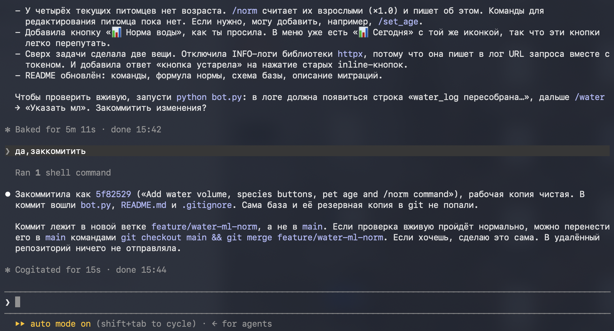

**Что добавлено:**

- `/water` — теперь с выбором «Просто отметка / Указать мл» (валидация: 0 < amount ≤ 2000, принимает запятую `120,5`).
- `/add_pet` — вид через кнопки, тип «Другое» — через текст, добавлен возраст (0 < age < 50).
- `/norm` и кнопка «📊 Норма воды» — расчёт рекомендованной нормы по весу, виду и возрасту.
- `/stats`, `/stats_week`, `/top` — показывают число отметок и мл.
- `/delete_pet` и кнопка «🗑 Удалить питомца».

**Миграция базы** выполняется автоматически при запуске бота:
- В `pets` добавлены колонки `species_code`, `custom_species`, `age_years`. Существующие питомцы получили коды `dog`/`cat`.
- В `water_log.amount_ml` теперь допускает NULL (для «просто отметки»). В SQLite нельзя снять `NOT NULL` через ALTER TABLE, поэтому таблица пересобрана в одной транзакции.
- Создана резервная копия `bot.db.backup-2026-10-03`, добавлена в `.gitignore`.

### 5.2. Кнопки выбора типа питомца

При добавлении питомца вместо текстового ввода теперь показываются кнопки:

- 🐶 Собака
- 🐱 Кот
- 🐹 Грызун
- 🐦 Птица
- ❓ Другое (если нестандартный питомец — ввод текстом)

Также добавлен вопрос о возрасте питомца — для расчёта нормы воды.

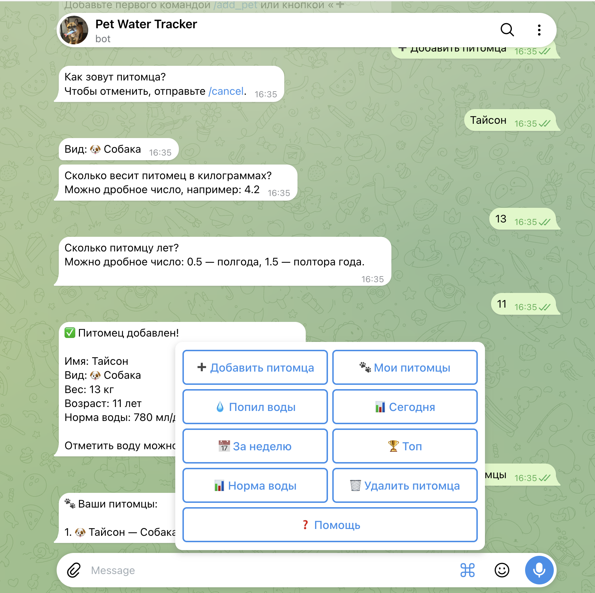

### 5.3. Команда /delete_pet

План изменений и реализация:

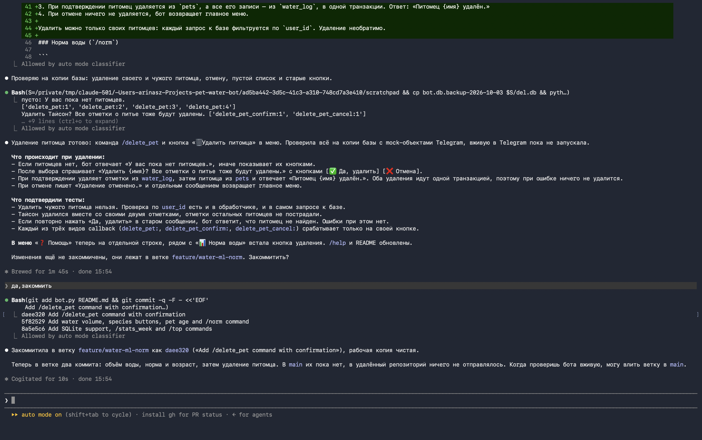

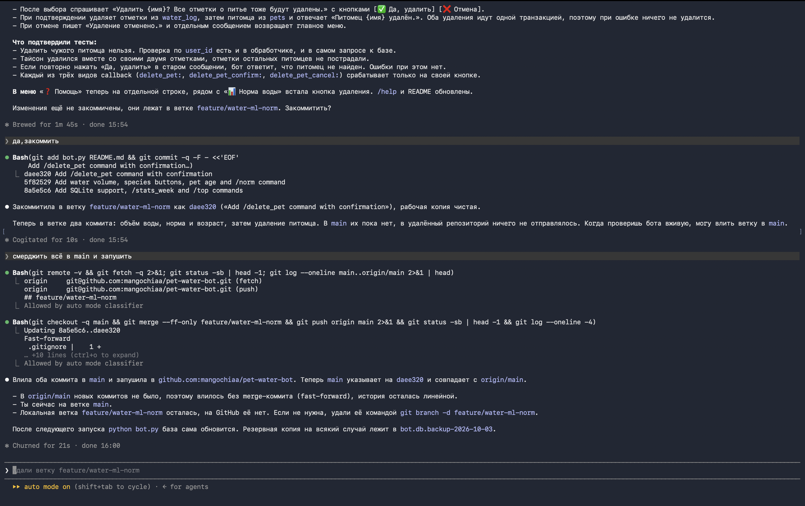

Команда удаления питомца с подтверждением. При удалении каскадно удаляются все отметки воды этого питомца. Проверка владельца — можно удалить только своего питомца. Также кнопка «🗑 Удалить питомца» появилась в главном меню.

### 5.4. Указание объёма воды в мл

При отметке воды теперь есть выбор:

- 💧 Просто отметка (без объёма, для тех, кто не отслеживает мл)
- 📏 Указать мл (ввод числа, валидация 0 < amount ≤ 2000)

В статистике `/stats` и `/stats_week` теперь суммируется не только количество отметок, но и общий объём воды.

### 5.5. Команда /norm

Новая команда показывает рекомендованную норму воды для каждого питомца с учётом его веса, вида и возраста:

- Базовая норма: ~50 мл/кг для собак и кошек, ~100 мл/кг для грызунов и птиц.
- Возрастной коэффициент: щенки/котята ×1.3, взрослые ×1.0, пожилые ×1.2.

Также показывает, сколько питомец выпил за сегодня и процент от нормы.

## 6. Новый фидбек после улучшений

После внесения улучшений пользователям были отправлены сообщения с просьбой протестировать обновлённого бота.

**Отзывы:**

**Пользователь 1 (про /delete_pet):**
> «Отлично, теперь могу удалять питомцев. Удобно, что спрашивает подтверждение.»

**Пользователь 2 (про /stats_week):**
> «Хочу ещё напоминания о том, что пора налить воды.»

## 7. Видео-демо

**Ссылка:** [ССЫЛКА_НА_ВИДЕО](https://drive.google.com/file/d/1ibpyK_54M04zgnTHxw54ueqx0k-CMH_l/view?usp=drivesdk)

В видео показаны: работа бота на Railway, команды `/start`, `/add_pet` с кнопками типа питомца, `/water` с выбором объёма, `/norm` с расчётом нормы, `/delete_pet` с подтверждением.

## 8. Выводы

**Что получилось хорошо:**

- Бот успешно задеплоен на Railway и работает 24/7 без моего компьютера.
- Railway Volume сохраняет базу данных между деплоями.
- Собрана обратная связь от 3 пользователей, и на её основе внесены конкретные улучшения.
- Все улучшения прошли через LLM-ассистента.
- Бот стал заметно полезнее: теперь есть выбор типа питомца, удаление, объём воды и расчёт нормы.

**Что можно улучшить дальше:**

- **Напоминания о питье** — самое частое пожелание в повторном фидбеке. Можно реализовать через `JobQueue` в python-telegram-bot.
- **График потребления за месяц** — визуализация динамики.
- **Редактирование питомца** — команда `/edit_pet` (изменить имя, вес, возраст).
- **Экспорт данных в CSV** — чтобы владелец мог показать ветеринару.
- **Продумывать лимиты AI-инструментов заранее** — если задача большая, лучше сразу выбирать тариф с достаточным количеством запросов или начинать в инструменте без лимитов (например, Claude Code по подписке Pro).

**Чему научилась:**

- Деплоить Telegram-бота на облачный хостинг (Railway) без собственного сервера.
- Работать с переменными окружения и Volume в облаке — чтобы данные не терялись при перезапуске.
- Адаптировать код под облачную среду: `DB_PATH` вместо хардкода, `Procfile` для воркера.
- Правильно собирать обратную связь: не просто спрашивать «нравится/не нравится», а уточнять конкретику («что неудобно?», «что бы добавил?»).
- Итерировать продукт на основе фидбека: пожелание → приоритезация → реализация → повторный опрос.
- Переключаться между AI-инструментами: когда закончился лимит в Cursor, перешла на Claude Code. Cursor удобен для небольших правок с графическим интерфейсом, Claude Code — для крупных задач с полным доступом к терминалу, Git и базе данных.
- Работать с Git-flow: изменения в отдельной ветке, проверка, потом мердж в `main` через fast-forward.
